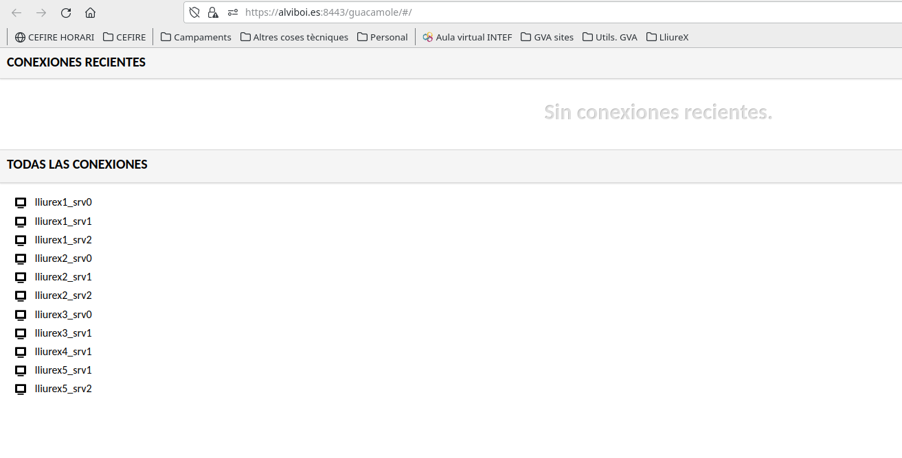
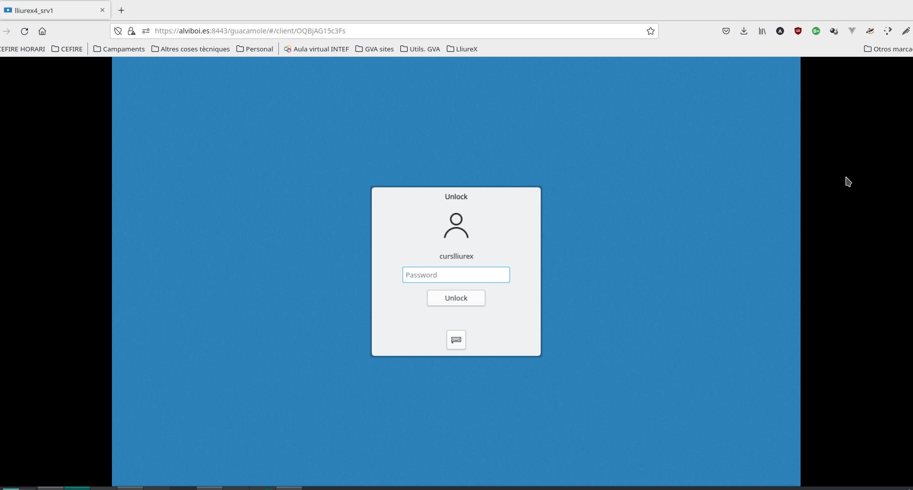
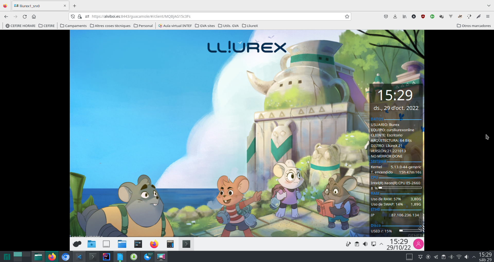
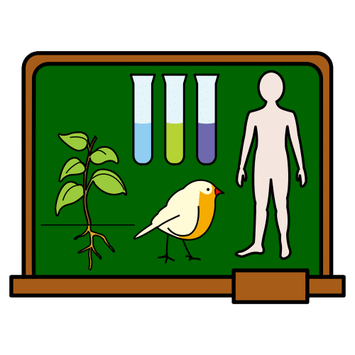
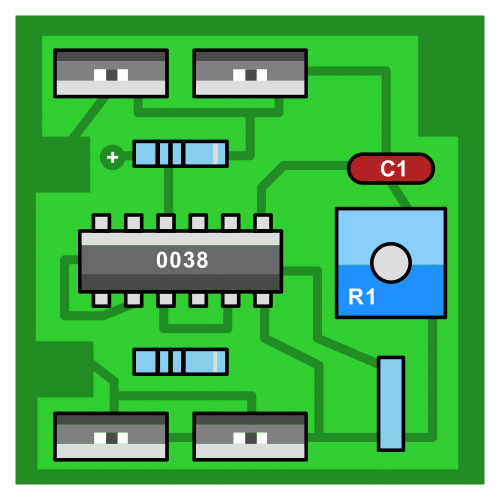

---
title: "TASCA 2"
author: [Alfredo Rafael Vicente Boix ]
date: "2022-10-30"
subject: "Proxmox"
keywords: [Xarxa, Instal·lació]
subtitle: "Proyectos realizados"
lang: "es"
page-background: "background10.pdf"
titlepage: true,
titlepage-rule-color: "360049"
titlepage-background: "background10.pdf"
colorlinks: true
toc-own-page: true
header-includes:
- |
  ```{=latex}
  \usepackage{awesomebox}
  \usepackage{caption}
  \usepackage{array}
  \usepackage{tabularx}
  \usepackage{ragged2e}
  \usepackage{multirow}


  ```
pandoc-latex-environment:
  noteblock: [note]
  tipblock: [tip]
  warningblock: [warning]
  cautionblock: [caution]
  importantblock: [important]
...

<!-- \awesomebox[violet]{2pt}{\faRocket}{violet}{Lorem ipsum…} -->

EXPERIENCIA DE AULA

alumne lliurex123

# Introducción

Vamos a tratar los dos último proyecto realizados en mi centro. Actualment estoy trabajando en un centro de recursos para el profesorado. Hay dos proyectos que estoy llevando a cabo una de ellos es para facilitar la orientación de las personas que llegan a a las instalaciones, muchos de ellos extranjeros que buscan clases de español para personas extranjeras y otro en uno de los cursos que he organizado. Al fin y al cabo mis alumnos son otros profesores.

En el edificio público existen dos instuciones:

* El centro de recursos
* Una escuela de adultos

Vamos a llamar a los dos proyectos de la siguiente manera:

* Iconos: Adecuación de la cartelería del centro.
* Guacamole: facilitar el acceso a los materiales del curso

# Contenido del artículo

## Origen de la experiencia

**Iconos**: El problema detectado en este caso son las persona que llegan y no hay nadie para recibirlas y orientarlas a la escuela de adultos que se encuentra en el segundo piso. A parte de eso hay gente que viene a hablar con algún asesor de formación.

**Guacamole**: Existe un curso que imparto que se llama LliureX para la tarea docente. LliureX es el sistema operativo que se usa en los centros de la Comunidad Valenciana, el sistema operativo es muy sencillo de utilizar pero si eres nuevo en la docencia requieres de un perqueño curso para familiarizarte y aprender un poco como funciona. El problema es que muchos docentes (y más si están aprendiendo) no tienen ese SO en casa y no es objeto del curso su instalación, ni su configuración. Y en el centro, las tareas que deben de realizar son las de docente. No existen horas libres para facilitar la realización del curso en los ordenadores del centro educativo al que están adscritos.

# Descripción detallada de la experiencia: proyecto, metodología, tareas realizadas por los alumnos, organización del aula...

**Iconos**: El acceso realizado a las instalaciones ha facilitado la fluidez de las personas que acceden facilitando su orientación dentro del centro.
En el caso de 

**Guacamole**:  En este caso se implanta una aplicación informática que facilita el accesos a diferentes ordenadores con LliureX para que puedan usar LliureX independientemente del sistema operativo que tengan instalado (IOS, Windows u otras distribuiones GNU/Linux). Los usuarios pueden consultar el siguiente vídeo para poder acceder.

Como ejemplo se proporciona el usuario: **alumne** con contraseña **lliurex123**. Se puede acceder directamente desde el siguiente enlace:

:::warning
Es necesario aceptar el certificado ssl, es un certificado propio, por eso el navegador no lo reconoce como válido. El dominio alviboi está registrado a mi nombre (**Al**fredo **Vi**cente **Bo**ix)
:::

["Acceder a Guacamole"](https://alviboi.es:8443/guacamole/#/)

["Videotutorial sobre cómo usar Apache Guacamole"](https://drive.google.com/file/d/1de3nVW0W02CSj3KulKb5XGAShigOupzA/view?usp=sharing)

# Evaluación del aprendizaje de los alumnos y de la propia experiencia.

En el caso de **Iconos** por experiencia se puede ver cómo la gente ha podido acceder directamente a las instalaciones de la Escuela de adultos sin tener que entrar a despachos a preguntar o estar perdidos por el centro.

En el caso de la aplicación **Guacamole** se ha visto cómo el 40% de las persona que ha usado el curso han accedido al sistema para poder realizar las actividades. Mucha gente que se apunta al curso ya tiene un ordenador con LLiureX en casa o utiliza máquinas virtuales. El problema de esto es que no todo el mundo tiene la destreza para poder implantarse este sistema o conoce a alguien que le ayude.

Al final de cada curso se realiza una encuesta, en los últimos años la encuesta ha reflejado el problema existente de no poder realizar las actividades ya que no disponían de tiempo para poder realizarlas en el centro.

# Recursos utilizados

La experiencia en el proyecto **Iconos** es grata, y sólo se ha usado la herramientas de ARASAAC para poder generar los pictogramas.

Los recursos utilizados en **Guacamole** han sido, una aplicación informática que permite crear conexiones VNC con otros ordenadores en la red. A parte de todas las aplicaciones asociadas al despliegue en web: Tomcat, Mysql, Nginx, etc...

Se ha comprabado cómo el pordentaje de abandono del curso ha disminuido considerblemente en las primeras actividades respecto a años anteriores. El principal problema de este tipo de aplicaciones es que se ha de disponer de algun ordenador conectado a la red, se puede hacer desde tu caso o con al proveedor de servicios. En este caso se estan usando dos ordenadores de un proveedor de servicios y de un ordenador en casa con diferentes máquinas virtuales para poder conectarse.

# Valoración global del proyecto: consecución de los objetivos propuestos, mejora del aprendizaje, capacidad de desarrollar experiencias similares...

El proyecto de **Iconos** ha sido recibido gratamente por parte de todos los asesores y el profesorado de la Escuela de adultos. Es un sistema que no cuesta nada implantar.

En la aplicación informática, la asistentes del curso se muestran sorprendidos de que una herramienta como esta exista. De hecho este mismo sistema puede crear máquinas virtuales de diferentes sistemas operativos, lo que permite poder usarlas para otros cursos que se necesiten apliciones concretas o que sean difíciles de instalar para los asistentes. De este manera disponen ya de un ordenador con todo lo necesario preinstalado.

# Recomendación final

Respcto al proyecto **Guacamole** existe un montón de documentación al respecto de cómo implantar los diferentes sistemas que he utilizado. Pero no todo el mundo podría replicarlas per se. Hacen falta ciertos conocimientos para poder hacer todo el despliegue. Creo que es importante que todos trabajemos en grupo para poder llevar a cabo proyectos así ya que cada una aporta sus conocimentos. Y al final aportamos lo que más nos gusta hacer y si eso facilita la vida a otras personas mejor que mejor.

# Imágenes del desarrollo de la experiencia en el aula o de los recursos creados














# Material interesante que pueda ayudar a los profesores a replicar la experiencia.

(@) https://guacamole.apache.org/
(@) https://tomcat.apache.org/
(@) https://www.ionos.es/servidores/vps
(@) https://arasaac.org/


