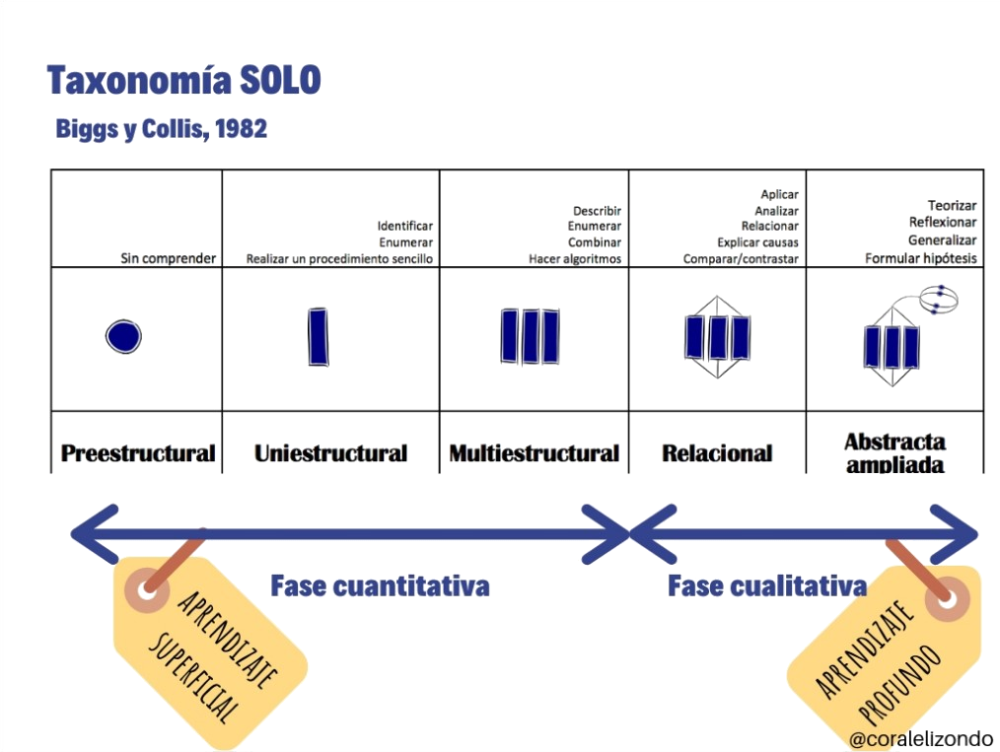

---
title: "Escenarios de aprendizaje y DUA"
author: [Alfredo Rafael Vicente Boix ]
date: "05-12-2022"
subject: "Proxmox"
keywords: [Xarxa, Instal·lació]
subtitle: "Tarea 3.3"
lang: "es"
page-background: "background10.pdf"
titlepage: true,
titlepage-rule-color: "360049"
titlepage-background: "background10.pdf"
colorlinks: true
toc-own-page: true
header-includes:
- |
  ```{=latex}
  \usepackage{awesomebox}
  \usepackage{caption}
  \usepackage{array}
  \usepackage{tabularx}
  \usepackage{ragged2e}
  \usepackage{multirow}


  ```
pandoc-latex-environment:
  noteblock: [note]
  tipblock: [tip]
  warningblock: [warning]
  cautionblock: [caution]
  importantblock: [important]
...

<!-- \awesomebox[violet]{2pt}{\faRocket}{violet}{Lorem ipsum…} -->

\vspace*{\fill}

{ height=50px }


Este trabajo así como el código que aparece en él está sujeto a una licencia creative commons que permite su difusión uso comercial reconociendo siempre la autoría de su creador. Este documento se encuentra para poder ser modificado en el siguiente repositorio de github:
<!-- CANVIAR L'ENLLAÇ -->
[Github de les tasques](https://github.com/alviboi/tasca12dua)
\newpage


# REFLEXIÓN

**¿Cómo hacemos para que los estudiantes aprendan lo que queremos que aprendan? En el vídeo se habla de alineamiento constructivo. Para Biggs, el alineamiento constructivo se refiere a alinear el sistema de enseñanza y evaluación, con los resultados de aprendizaje que pretendemos lograr. La respuesta está en el vídeo, ¿Podrías explicar cómo?**

¿Cuántas veces hemos oído a algún compañero de profesión, amigos o familiares decir... Uf yo estudiaba el día anterior y tenía más que suficiente? Creo que hasta yo alguna vez lo he comentado con algunos de mis compañeros. Incluso en la misma carrera universitaria he visto claros ejemplos de ello y no creo que sea casualidad que las asignaturas que más nos han gustado era precisamente aquellas en las que no podíamos o no nos servía de nada hacer eso.

A estas mismas persona que hacen esas aseveraciones se les puede plantear... ¿Y de qué asignaturas se trataba? La mayoría de las respuestas serán o que bien no lo saben o las de memorizar. Y es que desde que entramos a la escuela, o, al menos en la mayoría de casos que conozco, nos han estado entrenando en el mismo procedimiento, memorizar. Sería raro que no llegásemos a edades más avanzadas y no fuésemos unos expertos en aquello en lo que realmente nos han entrenado.

Y la gran cuestión sería ¿Es eso aprender...? La respuesta es No. Precisamente muchos de mis compañeros de profesión, entre los que me incluyo, no hemos aprendido realmente a aprender hasta que no nos hemos puesto a estudiar unas oposiciones. ¿Que la destreza de memorizar servirá? No me cabe la menor duda, pero no creo que se llegue a conseguir lo que realmente deseas: aprender.

Y es que el planteamiento debe partir en enunciar claramente los objetivos de aprendizaje. En el vídeo habla que esos planteamientos han de ser en términos de la Taxonomía SOLO, o sea platear los objetivos desde un aprendizaje superficial a un aprendizaje profundo. Si reflexionamos un poco sobre ello, podemos ver que es probablemente lo que nos plateamos de la manera más natural posible. Desde hacer simple identificaciones, hacer algoritmos, combinar, analizar hasta hacer reflexiones sobre ello.



La taxonomía SOLO acompaña el aprendizaje, de manera que el nivel de comprensión va aumentando bajo una base que poco a poco genera procesos cognitivos más complejos. Este es la manera más natural de aprender.

Por ello es necesario enunciar claramente lo que se va a evaluar y eligir las actividades que realmente van a llevar a conseguir satisfactoriamente esos objetivos, teniendo una base clara sobre los objetivos que realmente quieres alcanzar es cuando realmente se usan los procesos cognitivos para que los estudiantes alcancen realmente los objetivos planteados y no simplemente aprobar un examen.